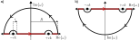

<h2> What we want to show </h2>

To begin this discussion, we state the electromagnetic wave equation for the scalar ($\varphi$) and vector ($\mathbf{A}$) potentials sourced by some time-dependent charge ($\rho$) and current $(\mathbf{J})$ density, respectively. In the Lorenz gauge, the sources and fields are related by the separate wave equations
$$
\begin{align}
    \nabla^2 \varphi - \frac{1}{c^2}\frac{\partial^2 \varphi}{\partial t^2} = -\frac{1}{\epsilon_0}\rho(\mathbf{r},t) \nonumber \\
    \nabla^2 \mathbf{A} - \frac{1}{c^2}\frac{\partial^2 \mathbf{A}}{\partial t^2} = -\mu_0 \mathbf{J}(\mathbf{r},t). \label{eq:emg}
\end{align} 
$$
Supposing that we know the electromagnetic potentials at every point in space, Eq\.$\ref{eq:emg}$ allows us to compute the charge and current densities that generated them. In the interest of practicality, our goal here is to invert this expression: we want to be able to compute the electromagnetic potentials generated by a given charge and current density. We will show that these relationships are given by
$$
\begin{align}
    \varphi(\mathbf{r}, t) &= \frac{1}{4\pi \epsilon_0}\int \frac{\rho(\mathbf{r}', t_r)}{|\mathbf{r} - \mathbf{r}'|} d\mathbf{r}' \nonumber \\
    \mathbf{A}(\mathbf{r}, t) &= \frac{\mu_0}{4\pi}\int \frac{\mathbf{J}(\mathbf{r}', t_r)}{|\mathbf{r} - \mathbf{r}'|} d\mathbf{r}', \label{eq:weq}
\end{align}
$$
which requires a surprisingly lengthy derivation. The symbol $t_r = t - |\mathbf{r} -\mathbf{r}'|/c$ is the retarded time, which indicates that the change in potential due to a disturbance in charge density $\rho$ (or current density) at position $\mathbf{r}'$ is only apparent at a position $\mathbf{r}$ once the field disturbance propagates the intervening distance $|\mathbf{r} - \mathbf{r}'|$ at the speed of light. 

<h2> The impulse response (Green function) </h2>

The wave equations in Eq.$\ \ref{eq:emg}$ take the general form

$$
\begin{equation}\label{eq:gf_deL}
    \hat{L}(\mathbf{r},t)f(\mathbf{r},t) = s(\mathbf{r},t),
\end{equation}
$$

 Linear operators for the electromagnetic potentials 

The exact expressions for the linear operators are

$$
\begin{equation}
    \hat{L}_\varphi(\mathbf{r},t) := \epsilon_0 \left(\nabla^2 - \frac{1}{c^2} \partial_t^2\right)
\end{equation}
$$
which acts on the scalar potential by $\hat{L}_\varphi(\mathbf{r},t) \varphi(\mathbf{r},t) = \rho(\mathbf{r},t)$ and
$$
\begin{equation}
    \hat{L}_A(\mathbf{r},t) := \frac{1}{\mu_0} \left(\nabla^2 - \frac{1}{c^2} \partial_t^2\right)
\end{equation}
$$
which acts on each component of the vector potential $\hat{L}_A(\mathbf{r},t) A_i(\mathbf{r},t) = J_i(\mathbf{r},t)$ for $i = x,y,z$. Since the equations differ at most by a pre-factor, it is easy to swap out this pre-factor to find the other components once one component is solved.

in which the linear operator $\hat{L}$ acting on some profile $f(\mathbf{r},t)$ (in our case, the potentials) results in a quantity equal to the source term $s(\mathbf{r},t)$ (in our case, the charge and current densities). While the form specialized to the case of electromagnetic potentials is accessible in the box above, we will choose to analyze the general form to emphasize that the process of inverting the linear operator to yield $f$ from $s$ can be done for an arbitrary linear system and that there is nothing special about electromagnetic fields in this sense.

The desired inversion of Eq. $\ref{eq:gf_deL}$ is achieved by computing the Green function, which is just a fancy name for the spatiotemporal impulse response. That is to say that the Green function $G$ is the field $f$ at position $\mathbf{r}$ and time $t$ generated by some instantaneous excitation at position $\mathbf{r}'$ and time $t'$. We denote this function as $G(\mathbf{r},t;\mathbf{r}',t')$, indicating that $G$ is directly a function of $\mathbf{r}$ and $t$ while the parameters $\mathbf{r}'$ and $t'$ detail the position and time of the excitation. To be more specific, the instantaneous excitations are modelled by delta functions so that the governing equation that defines the Green function is

$$
\begin{equation}\label{eq:gf_L}
    \hat{L}(\mathbf{r},t)G(\mathbf{r},t;\mathbf{r}',t') = \delta(\mathbf{r} - \mathbf{r}')\delta(t - t').
\end{equation}
$$

We can pause here and ask how Eq.$\ \ref{eq:gf_L}$ is useful to us. The answer lies in the fact that any arbitrary source $s(\mathbf{r},t)$ can be expanded in the delta function basis by

$$
\begin{equation}\label{eq:gf_delta}
    s(\mathbf{r},t) = \int s(\mathbf{r}',t')\delta(\mathbf{r} - \mathbf{r}')\delta(t - t') d\mathbf{r}' dt'.
\end{equation}
$$

This integral is trivially true, but it is convenient because it allows us to act on each side of Eq.$\ \ref{eq:gf_L}$ by the integral operator $\int d\mathbf{r}' dt' s(\mathbf{r}',t')$ for some arbitrary source distribution $s$. The end result is 

$$
\begin{equation}\label{eq:gf_LG}
    \hat{L}(\mathbf{r}',t')\left(\int G(\mathbf{r},\mathbf{t};\mathbf{r}',t') s(\mathbf{r}',t') d\mathbf{r}'dt'\right) = s(\mathbf{r},t).
\end{equation}
$$

 Derivation 

This is straightforward, but still worth doing carefully. Multiply and integrate:
$$
\begin{equation}
\int s(\mathbf{r}',t') d\mathbf{r}'dt' \left( \hat{L}(\mathbf{r},t)G(\mathbf{r},t;\mathbf{r}',t') \right) = \int s(\mathbf{r}',t') d\mathbf{r}'dt' \left(\delta(t - t') \delta(\mathbf{r} - \mathbf{r}') \right).
\end{equation}
$$
On the left-hand side, we can pull $\hat{L}(\mathbf{r},t)$ out of the integral because it does not depend on the integrated (primed) coordinates. The right-hand side is just the integral we introduced in Eq.$\ \ref{eq:gf_delta}$. Putting it all together, we find that
$$
\begin{equation}
    \hat{L}(\mathbf{r}',t')\int G(\mathbf{r},\mathbf{t};\mathbf{r}',t') s(\mathbf{r}',t') d\mathbf{r}'dt' = s(\mathbf{r},t),
\end{equation}
$$
and all that's left is to apply our convenient parentheses to make this expression easy to compare to Eq.$\ \ref{eq:gf_deL}$.

Finally comparing Eq. $\ref{eq:gf_LG}$ to Eq. $\ref{eq:gf_deL}$, we find that the Green function can be applied to the source term by
$$
\begin{equation}\label{eq:Gapp}
    f(\mathbf{r},t) = \int G(\mathbf{r},\mathbf{t};\mathbf{r}',t') s(\mathbf{r}',t') d\mathbf{r}'dt'
\end{equation}
$$
to compute the resulting field $f$.

<h2> Specialize: The electromagnetic Green function </h2>

Now we specialize the Green function analysis to the case of electromagnetic fields. Substituting in the linear operator introduced by the wave equation, the problem we must solve is
$$
\begin{equation}\label{eq:Green}
    \left(\nabla^2 - \frac{1}{c^2}\frac{\partial^2}{\partial t^2}\right)G(\mathbf{r},t;\mathbf{r}',t') = \eta \delta(\mathbf{r} - \mathbf{r}')\delta(t - t'),
\end{equation}
$$
where $\eta = 1/\epsilon_0$ for the scalar potential and $\eta = \mu_0$ for components of the vector potential. Solve Eq.$\ \ref{eq:Green}$ by expanding both sides in the plane-wave (Fourier) basis so that the differential operators reduce to momenta $\mathbf{k}$ and energies $\omega$. Doing so, we find a new expression for the Green function
$$
\begin{equation}\label{eq:Gs}
    G(\mathbf{q},\tau) = \frac{\eta c^2}{(2\pi)^4}\int \frac{1}{\omega^2 - c^2 k^2} e^{i(\mathbf{k}\cdot \mathbf{q} - \omega \tau)}d\mathbf{k} d\omega.
\end{equation}
$$

 Derivation 

To begin, we define $\tilde{G}(\mathbf{k},\omega;\mathbf{r}',t')$ as the 3+1-dimensional Fourier transform of the Green function:
$$
\begin{equation}
    \tilde{G}(\mathbf{k},\omega;\mathbf{r}',t') = \int G(\mathbf{r},t; \mathbf{r}',t') e^{-i(\mathbf{k}\cdot \mathbf{r} - \omega t)}d\mathbf{r} dt.
\end{equation}
$$
Note that the primed coordinate parameters remain spatial because they indicate that we are interested in the response function (in the Fourier domain or otherwise) due to a disturbance at position $\mathbf{r}'$ and time $t'$. The corresponding inverse transformation is
$$
\begin{equation}\label{eq:pwe}
    G(\mathbf{r},t;\mathbf{r}',t') = \frac{1}{(2\pi)^4}\int \tilde{G}(\mathbf{k},\omega; \mathbf{r}',t') e^{i(\mathbf{k}\cdot \mathbf{r} - \omega t)}d\mathbf{k} d\omega,
\end{equation}
$$
which we can substitute into Eq.$\ \ref{eq:Green}$ to find
$$
\begin{align}
    \left(\nabla^2 - \frac{1}{c^2}\frac{\partial^2}{\partial t^2}\right)\int \tilde{G}(\mathbf{k},\omega; \mathbf{r}',t') e^{i(\mathbf{k}\cdot \mathbf{r} - \omega t)}d\mathbf{k}d\omega &= (2\pi)^4 \eta \delta(\mathbf{r} - \mathbf{r}')\delta(t - t')\nonumber \\
    \rightarrow \int \left(\frac{\omega^2}{c^2} - k^2\right) \tilde{G}(\mathbf{k},\omega; \mathbf{r}',t') e^{i(\mathbf{k}\cdot \mathbf{r} - \omega t)}d\mathbf{k}d\omega &=  (2\pi)^4 \eta \delta(\mathbf{r} - \mathbf{r}')\delta(t - t') \label{eq:gzero}
\end{align}
$$
To simplify the right-hand side, use the fact that
$$
\begin{equation}
\delta(\mathbf{r} - \mathbf{r}')\delta(t - t') = \delta(x - x')\delta(y - y')\delta(z - z')\delta(t - t')
\end{equation}
$$
and use the delta function identities to substitute
$$
\begin{align}
\delta(t - t') &= \frac{1}{2\pi}\int e^{-i\omega(t - t')}d\omega \\
\delta(\xi - \xi') &= \frac{1}{2\pi}\int e^{ik_\xi(\xi - \xi')}dk_\xi, \quad \xi = x,y,z.
\end{align}
$$
As a result, we find the right-hand side to be
$$
\begin{align}
(2\pi)^4 \eta \delta(\mathbf{r} - \mathbf{r}')\delta(t - t') &= \eta \int e^{i(\mathbf{k}\cdot (\mathbf{r} - \mathbf{r}') - \omega (t - t'))}d\mathbf{k}d\omega \nonumber \\
&= \eta \int e^{i(\mathbf{k}\cdot \mathbf{r}- \omega t)}e^{-i(\mathbf{k}\cdot \mathbf{r}'- \omega t')}d\mathbf{k}d\omega. \label{eq:rhs_delta}
\end{align}
$$
For the last inequality in Eq.$\ \ref{eq:rhs_delta}$, we separated the complex exponentials for primed and unprimed coordinates, allowing us to move everything in Eq.$\ \ref{eq:gzero}$ to one side:
$$
\begin{equation}
    \int \left[\left(\frac{\omega^2}{c^2} - k^2\right) \tilde{G}(\mathbf{k},\omega; \mathbf{r}',t') - \eta e^{-i(\mathbf{k}\cdot \mathbf{r}' - \omega t')}\right]e^{i(\mathbf{k}\cdot \mathbf{r} - \omega t)}d\mathbf{k}d\omega = 0.
\end{equation}
$$
It follows from the orthonormality of the plane waves that the term in brackets must equal zero. This equality is solved when the transformed Green function is
$$
\begin{equation}\label{eq:gf_fr}
    \tilde{G}(\mathbf{k},\omega;\mathbf{r}',t') = \eta c^2 \frac{e^{-i(\mathbf{k}\cdot \mathbf{r}' - \omega t')}}{\omega^2 - c^2k^2}.
\end{equation}
$$
Finally, apply the inverse Fourier transformation defined in Eq. $\ref{eq:pwe}$ to the Green function in Eq.$\ \ref{eq:gf_fr}$ to get the real-space solution
$$
\begin{equation}
    G(\mathbf{r},t;\mathbf{r}',t') = \frac{\eta c^2}{(2\pi)^4}\int \frac{1}{\omega^2 - c^2 k^2} e^{i(\mathbf{k}\cdot(\mathbf{r} - \mathbf{r}') - \omega(t - t'))}d\mathbf{k} d\omega.
\end{equation}
$$
Note that dependence on spatial and temporal coordinates only appear in the differences $\mathbf{r} - \mathbf{r}'$ and $t - t'$. To simplify the notation, we can then define $\mathbf{q} = \mathbf{r} - \mathbf{r}'$ and $\tau = t - t'$ so that the Green function has the simple form
$$
\begin{equation}
G(\mathbf{q},\tau) = \frac{\eta c^2}{(2\pi)^4}\int \frac{1}{\omega^2 - c^2 k^2} e^{i(\mathbf{k}\cdot \mathbf{q} - \omega \tau)}d\mathbf{k} d\omega.
\end{equation}
$$

where $\mathbf{q} = \mathbf{r} - \mathbf{r}'$ and $\mathbf{\tau} = t - t'$. It then suffices to solve for the Green function in this shifted coordinate system, after which we can just re-insert $\mathbf{r}$ and $\mathbf{r}'$ (as well as $t$ and $t'$) to find a clear expression for $G(\mathbf{r},t;\mathbf{r}',t')$.

We can evaluate the integral in Eq.$\ \ref{eq:Gs}$ by converting to spherical coordinates. Doing so, it is straightforward to integrate over the azimuthal and polar angles, leaving only an integral over the radial coordinate $k = |\mathbf{k}|$:
$$
\begin{equation}\label{eq:G1}
    G(\mathbf{q},\tau) = \frac{2 \eta c^2}{(2\pi)^3}\frac{1}{iq} \int_{0}^\infty \Omega(k,\tau) k \left(e^{ikq} - e^{-ikq}\right) dk
\end{equation}
$$
which includes the contribution $\Omega(k,\tau)$ found by integrating over the angular frequency $\omega$:
$$
\begin{equation}\label{eq:Om1}
 \Omega(k,\tau) =P.V.\int_{-\infty}^{\infty} \frac{e^{-i\omega \tau}}{(\omega - ck)(\omega + ck)}d\omega.
\end{equation}
$$

Derivation

Starting with the integral for the Green function in Eq.$\ \ref{eq:Gs}$,
$$
\begin{equation}\label{eq:Gs_der}
    G(\mathbf{q},\tau) = \frac{\eta c^2}{(2\pi)^4}\int \frac{1}{\omega^2 - c^2 k^2} e^{i(\mathbf{k}\cdot\mathbf{q} - \omega \tau)}d\mathbf{k} d\omega,
\end{equation}
$$
transform into spherical coordinates by the substitution
$$
\begin{align}
k_x &= k\sin\theta \cos\phi \\
k_y &= k\sin\theta \sin\phi \\
k_z &= k\cos\theta.
\end{align}
$$
Since the integral will be taken over all angles $\theta$ and $\phi$, we may choose a coordinate set in which $k_z$ is parallel to $q_z$ for a given arbitrary input $\mathbf{q}$. This choice simplifies the dot product in the complex exponential; in the definition $\mathbf{k}\cdot \mathbf{r} = kr \cos \gamma$, the angle $\gamma$ between vectors $\mathbf{k}$ and $\mathbf{q}$ becomes simply the polar angle $\theta$ so that $\mathbf{k}\cdot \mathbf{q} = kq \cos\theta$. Finally, insert the defintion of the differential volume element $d\mathbf{k} = k^2 \sin^2\theta dk d\theta d\phi$ to find

$$
\begin{equation}\label{eq:G0}
    G(\mathbf{q},\tau) = \frac{\eta c^2}{(2\pi)^4} \int_{0}^\infty dk\int_{-\infty}^{\infty}\frac{k^2}{\omega^2 - c^2 k^2} e^{-i\omega \tau} d\omega \int_0^\pi e^{ikq\cos\theta} \sin \theta d\theta \int_{0}^{2\pi} d\phi.
\end{equation}
$$
The integral over azimuthal angle $\phi$ in Eq. $\ref{eq:G0}$ is trivial because the integrand lacks $\phi$-dependence. We integrate over the polar angle $\theta$ by substituting $u = ikq \cos \theta$ and $du = -ikq \sin \theta d\theta$ (and accordingly, $\sin\theta d\theta = - du/ikq$). This integral evaluates to
$$
\begin{equation}
\int_0^\pi e^{ikq\cos\theta} \sin \theta d\theta = -\frac{1}{ikq}\int_{ikq}^{-ikq} e^u du = \frac{1}{iq}\frac{e^{ikq} - e^{-ikq}}{k},
\end{equation}
$$
leaving the remaining integration over $k$ and $\omega$,
$$
\begin{equation}\label{eq:G1_der}
    G(\mathbf{q},\tau) = \frac{2 \eta c^2}{(2\pi)^3}\frac{1}{iq} \int_{0}^\infty k \left(e^{ikq} - e^{-ikq}\right) dk\int_{-\infty}^{\infty}\frac{e^{-i\omega \tau}}{\omega^2 - c^2k^2}  d\omega.
\end{equation}
$$
The remaining difficulty is in the integration over $\omega$, which we call $\Omega(k,\tau)$. Factoring the denominator $\omega^2 - c^2k^2 = (\omega - ck)(\omega + ck)$, it is clear that there are singularities in the integrand when $\omega = \pm ck$. Since the integrand is undefined at these points, the best we can do is the principal value integration
$$
\begin{equation}
    \Omega(k,\tau) = P.V.\int_{-\infty}^{\infty} \frac{e^{-i\omega \tau}}{(\omega - ck)(\omega + ck)}d\omega,
\end{equation}
$$
which removes an infinitesimally small symmetric interval about each pole so the result stays finite.

 A note on the principal value integration 

The first thing to point out is that integration is done in the principal value (P.V.) sense, which means that we remove a symmetric region of size $2\epsilon$ centered around each pole $\omega = \pm ck$. 

This must be done to remove the singularities so that the integral remains possible to evaluate. Finally, we take the limit as $\epsilon \rightarrow 0$ to remove the error introduced by the reduction in the integral limits. The quick justification for why we do this is that we are interested in this quantity $\Omega(k,t)$ only in the distributional sense (as the limit of a sequence of functions to be integrated against a test function). In this case, we are clearly following by an integral over $k$ so that the test function is simply the integrand of Eq.$\ \ref{eq:G1}$. 

Most of the remaining effort will be to evaluate the integral in Eq.$\ \ref{eq:Om1}$. We see in the next section that the integral can be calculated by analytic continuation of the integrated variable $\omega$ (and corresponding integrand) into the complex domain and performing a complex line integral whose path includes the integral over the real line that we aim to find.

<h2>Principal value integration in the complex plane</h2>

We begin to evaluate the integral in Eq.$\ \ref{eq:Om1}$ by explicitly imposing the limits dictated by the principal value integration procedure: remove a symmetric interval of length $2\epsilon$ about the poles at $\pm ck$. In the sense of distributions, we may then define $\Omega$ as the limit of a sequence of functions defined as the integral over these limits as the excluded interval $\varepsilon \rightarrow 0$. Restated in mathematical notation (and more clearly), 

$$
\begin{equation}\label{eq:rlim}
	\Omega(k,\tau) = \lim_{\epsilon \rightarrow 0}\left(\int_{-\infty}^{-ck - \epsilon}d\omega + \int_{-ck + \epsilon}^{ck - \epsilon}d\omega + \int_{ck + \epsilon}^{\infty} d\omega \right) \frac{e^{-i\omega \tau}}{(\omega - ck)(\omega + ck)}.
\end{equation}
$$
While this is an integral over the real line, we can evaluate it easily by taking the analytic continuation
$$
\begin{equation}\label{eq:zintegrand}
f(z) = \frac{e^{-iz \tau}}{(z - ck)(z + ck)},
\end{equation}
$$

and performing a closed line integral in the complex plane. The figure below shows how we can define a closed contour that includes the real-line principal value integration (the red line) and semicircular arcs which avoid the singularities so that $f(z)$ is analytic over the path. 

  

Figures 1a) and b) close the contour in the upper and lower-half plane, respectively. As of now, we do not know which direction is corrent. But in either case, we make the choice to exclude the poles from within the contour so that the line integral is zero by the residue theorem. The real-line integral we want is then found from
$$
\begin{equation}\label{eq:omfinal}
	\Omega(k,\tau) = - \lim_{R\rightarrow \infty}\lim_{\epsilon \rightarrow 0} \left(\int_{S(-ck,\epsilon)} dz + \int_{S(ck,\epsilon)} dz + \int_{S(0,R)} dz\right)f(z),
\end{equation}
$$

 Derivation 

The contours $\mathscr{C}$ shown in the Figure contain the limits
$$
\begin{align}\label{eq:path}
	&\oint_{\mathscr{C}} f(z) dz = \Omega(k,t) + \lim_{R\rightarrow \infty} \lim_{\epsilon \rightarrow 0} \left(\int_{S(-ck,\epsilon)} dz + \int_{S(ck,\epsilon)} dz + \int_{S(0,R)} dz\right)f(z).
\end{align}
$$
Though the ordering is swapped, the path traverses the real line from $-\infty$ to $-ck -\varepsilon$, a small semicircle about the pole at $-ck$ ($S(-ck,\varepsilon)$), a path along the real line from $-ck + \varepsilon$ to $ck - \varepsilon$, a small semicircle about the pole at $ck$ ($S(ck,\varepsilon)$), the real line from $ck + \varepsilon$ to $\infty$, and a semicircular arc with infinite radius connecting from $+\infty$ to $-\infty$ ($S(0,R)$).

If we define the excursions around each singularity so that $f(z)$ contains no poles within its boundaries, then $f(z)$ is analytic everywhere within the contour so the integral $\oint_{\mathscr{C}} f(z) dz = 0$ by the residue theorem. Eq. $\ref{eq:path}$ then rearranges to
$$
\begin{equation}
	\Omega(k,t) = - \lim_{\epsilon \rightarrow 0} \left(\int_{S(-ck,\epsilon)} dz + \int_{S(ck,\epsilon)} dz + \int_{S(0,R)} dz\right)f(z).
\end{equation}
$$
That is, we can calculate the desired integral $\Omega(k,t)$ by evaluating only the semicircular contours about each pole along with the infinite radius semicircle that connects the positive and negative real axes. 

where the notation $S(a,b)$ denotes a semicircular arc of radius $b$ at position $a$. We must now impose the physical constraint that $\tau > 0$, which corresponds to the retarded propagator. In the analysis of the electromagnetic wave equation, this means that the existence of a charge at time $t$ is only seen in the electromagnetic fields at later times $t' > t$, and the disturbance does not travel backward in time. However, it is a quirk of the laws of physics that we can also fix $\tau < 0$ and still get a perfectly good mathematical solution. For the retarded propagator, we determine that the integral must follow subfigure a) (closure in the lower half plane). We can further show that the semicircular arc over $R$ as $R \rightarrow \infty$ is zero, so that we can find $\Omega(k,\tau)$ strictly from integration over the semicircular contours.

 Integration over infinite-radius arc 

The constraints on the integration path arise from integration along the arc of radius $R$ over an angle $\pi$. To determine whether this arc should traverse through the upper- or lower-half plane, we need to observe the asymptotic behavior of the numerator $f(z) = e^{-izt}$ (because we know that the contribution from the denominator tends to zero as both the real and imaginary parts of $z$ go to zero). Parametrizing the integrand in polar coordinates, the numerator along the arc is
$$
\begin{equation}
	f(z) = e^{-iR(\cos \theta + i \sin \theta) \tau} =  e^{-iR\cos \theta \tau}  e^{R \sin \theta \tau}.
\end{equation}
$$
When $\tau > 0$, $\sin\theta$ must be negative because if $\sin\theta \geq 0$, then the term $e^{R \sin \theta \tau}$ would diverge as $R \rightarrow \infty$. This quantity is negative only when the angle $\pi < \theta < 2\pi$, which correspond to the lower half plane (for strict equality, the sine is zero so the points at $\theta = \pi$ and $\theta = 2\pi$ are well-behaved). Consequently, we must choose a contour that closes in the lower half plane where $e^{R \sin \theta \tau} \rightarrow 0$ as $R\rightarrow \infty$. In fact, the integral over the arc can be bounded by the triangle inequality to find
$$
\begin{equation}
	\left|\int_{S(0,R)} e^{- i R \tau \cos \theta} e^{-R \tau \sin \theta} dz \right| \leq \int \left| R e^{-R \tau}\right||d\theta| \leq \pi \left|R e^{-R\tau}\right|.
\end{equation}
$$
Taking the limit as $R\rightarrow \infty$, we find that the exponential dominates so that $\lim_{R\rightarrow \infty} |Re^{-R\tau}| = 0$. In the end, the infinite-radius arch contributes nothing to the contour integral.

 Complaint about the way these propagators are commonly calculated 

Choosing contours that exclude poles from the integration region is the most convenient choice, but it is not required. We would find the same end result for $\Omega(k,\tau)$ if we included the poles inside the contour. If $\tau > 0$ (retarded propagator), we always need to close the contour in the lower half plane. Then, included the poles in this contour, the residue theorem tells us that the evaluation of the integral about the entire arc is just the residue from the two poles (instead of zero for the pole-free contour). But now the semicircular arc must go about each pole in the opposite direction compared to the pole-free integration, so half the effect of each pole is negated to give the same result as just excluding them in the first place. 

The way we choose to perform an integral does not change its physical interpretation. Though, for example, if we want the solution for $\tau < 0$, the contour closure will be different so the integral is performed differently. This just makes the function defined piecewise for $\tau > 0$ (retarded) and $\tau < 0$ (advanced), although we don't have much physical use for the advanced solution. I think things like the <a href="https://en.wikipedia.org/wiki/Propagator#Feynman_propagator"> Feynman propagator</a> are just a byproduct of the hand-wavy way that the deformation is done around the poles. To me, the idea of imbuing a method for applying math to a problem with physical meaning, much like the insistence that virtual transitions and virtual particles are "real" because we choose to do time-dependent perturbation theory, is lazy and counterproductive. And I still think that's being charitable to this approach; in reality it's just bad math.

We can perform the integrations for the semicircular deformations about each pole to find
$$
\begin{align}
    \int_{S(-ck,\epsilon)}f(z) dz &= -\frac{i\pi e^{ick\tau}}{2ck} \label{eq:splus}\\
	\int_{S(ck,\epsilon)}f(z) dz &= \frac{i\pi e^{-ick\tau}}{2ck} \label{eq:sminus}.
\end{align}
$$

 Derivation 

Since the contour is closed in the lower-half plane and we chose to exclude the poles from the line interior, the excursions around the poles must also extend into the lower half plane and proceed in the positive (counter-clockwise diraction). Beginning with the pole at $-ck$, we evaluate the integral in the neighborhood of the singularity by defining $z' = z + ck$ and $dz' = dz$. Doing so, the integral (over the integrand in Eq.$\ \ref{eq:zintegrand}$) becomes
$$
\begin{equation}\label{eq:zpint}
	\int_{S(-ck,\epsilon)}f(z) dz = e^{ick\tau} \int_{S^+(0,\epsilon)} \left(\frac{e^{-i z' \tau}}{z' - 2ck}\right)\frac{1}{z'}dz'
\end{equation}
$$
The expression in parentheses is analytic on a disk of radius $2ck$ centered at $z' = 0$. Since the deformation integral takes place along a semicircle with radius $\epsilon < 2ck$, the analyticity condition holds along the integration path so we can expand the parenthetical term in a power series. Defining the integrand in Eq.$\ \ref{eq:zpint}$ as $u(z)$, this power series expansion gives 
$$
\begin{equation}
	u(z) = \left(a_0 + \sum_{n = 1}^{\infty}a_n z^n\right)\frac{1}{z} = \frac{a_0}{z} + \sum_{n = 1}^{\infty}a_n z^{n - 1} = \frac{a_0}{z} + P(z),
\end{equation}
$$
where we collected the analytic power series terms into the function $P(z)$. Since $P(z)$ is a power series, it is bounded by some maximum value $M$ along the semicircular contour over which we are integrating. The contour integral about this term is then bounded by the maximum value using the triangle inequality
$$
\begin{equation}
	\left|\int_{S(0,\epsilon)}P(z)dz\right| \leq \int_{S(0,\epsilon)}M |dz| =  M \pi\epsilon.
\end{equation}
$$
Since $\lim_{\epsilon \rightarrow 0} M\pi \epsilon = 0$, we conclude from the ineqality that the contour integral of $P(z)$ is zero. What remains is the integral over the singular term of $u(z)$. Using the fact that $a_0 = - 1/(2ck) $ (since $a_0$ is just the power series expansion term when $z' = 0$), we can evaluate the integral directly to find
$$
\begin{equation}\label{eq:defint}
	\int_{S(-ck,\epsilon)}f(z) dz = -\frac{e^{ick\tau}}{2ck}\int_{S(\epsilon,0)} \frac{dz}{z} = -\frac{i e^{ick\tau}}{2ck}\int_{-\pi}^0 d\theta = -\frac{i\pi e^{ick\tau}}{2ck}.
\end{equation}
$$
To evaluate Eq.$\ \ref{eq:defint}$, we defined $z = \epsilon e^{i\theta}$ (and $dz = i\epsilon e^{i\theta} d\theta$) to integrate over the semicircular contour in the lower-half plane.

The integral over the other pole goes exactly the same, except for a sign change due to the location of the pole, so that
$$
\begin{equation}
	\int_{S(ck,\epsilon)}f(z) dz = \frac{i\pi e^{-ick\tau}}{2ck}.
\end{equation}
$$

Applying Eqs. $\ref{eq:splus}$ and $\ref{eq:sminus}$ to the result in Eq.$\ \ref{eq:omfinal}$, we find
$$
\begin{equation}\label{eq:omegafinal}
	\Omega(k,\tau) = \frac{i\pi}{2ck}\left(e^{ick\tau} - e^{-ick\tau}\right),
\end{equation}
$$
which we may finally use to evaluate the integral in Eq.$\ \ref{eq:G1}$ for the Green function. The result is that

$$
\begin{equation}
	G(\mathbf{q},\tau) = -\frac{\eta c}{4\pi q}\delta(q - c\tau).
\end{equation}
$$

 Derivation 

For convenience, restate the Green function integral from earlier:
$$
\begin{equation}
    G(\mathbf{q},\tau) = \frac{2 \eta c^2}{(2\pi)^3}\frac{1}{iq} \int_{0}^\infty \Omega(k,\tau) k \left(e^{ikq} - e^{-ikq}\right) dk.
\end{equation}
$$

Substituting Eq.$\ \ref{eq:omegafinal}$ for $\omega(k,\tau)$
$$
\begin{equation}
	G(\mathbf{q},\tau) = \frac{\eta}{(2\pi)^2}\frac{c}{2 q} \int_{0}^\infty \left(e^{ik(q + c\tau)} - e^{ik(q - c\tau)} - e^{-ik(q - c\tau)} + e^{-ik(q + c\tau)}\right) dk.
\end{equation}
$$
Defining $f(k) = \exp(ik(q \pm c\tau))$, we can group these integrals into ones over all values of $k$ using
$$
\begin{equation}
	\int_0^\infty f(-k)dk = -\int_0^{-\infty}f(k)dk = \int_{-\infty}^0 f(k)dk,
\end{equation}
$$
so that
$$
\begin{equation}
	G(\mathbf{q},\tau) = \frac{\eta}{(2\pi)^2}\frac{c}{2 q} \left( \int_{-\infty}^\infty e^{ik(q + c\tau)}dk - \int_{-\infty}^\infty e^{ik(q - c\tau)}dk\right).
\end{equation}
$$
The remaining integrals are the familiar delta function integrals, allowing us to simplify the Green function to
$$
\begin{equation}\label{eq:Gpen}
	G(\mathbf{q},\tau) = \frac{\eta c}{4\pi q} \left[ \delta(q + c\tau) dk - \delta(q - c\tau) \right].
\end{equation}
$$
It is tempting to say that Eq.$\ \ref{eq:Gpen}$, containing two delta functions, includes both the retarded ($\delta(q - c\tau)$) and advanced ($\delta(q + c\tau)$) propagators. But we were only able to perform the integrations by fixing the parameter $\tau > 0$, in which case the advanced delta function condition is never satisfied (since $q > 0$ is a magnitude). So we can safely remove this term, and we are left with
$$
\begin{equation}
	G(\mathbf{q},\tau) = -\frac{\eta c}{4\pi q} \delta(q - c\tau).
\end{equation}
$$
If we want the advanced operator, we just need to repeat the process under the condition $\tau < 0$, which requires closure in the lower-half plane. In the end, we end up with exactly what is suggested by Eq.$\ \ref{eq:Gpen}$, which is why its possible to be sloppy and still get the "correct" answer. 

We can now apply the Green function according to Eq.$\ \ref{eq:Gapp}$ with source terms $s(\mathbf{r},t) = -\rho(\mathbf{r},t)$ and $s_i = -J_i(\mathbf{r},t)$ for the scalar potential and $i$th component of the vector potential, respectively. Also applying the definition of our variable $\eta = 1/\epsilon_0$ (scalar potential) and $\eta = \mu_0$ (vector potential), we finally find
$$
\begin{align}
    \varphi(\mathbf{r}, t) &= \frac{1}{4\pi \epsilon_0}\int \frac{\rho(\mathbf{r}', t_r)}{|\mathbf{r} - \mathbf{r}'|} d\mathbf{r}' \nonumber \\
    \mathbf{A}(\mathbf{r}, t) &= \frac{\mu_0}{4\pi}\int \frac{\mathbf{J}(\mathbf{r}', t_r)}{|\mathbf{r} - \mathbf{r}'|} d\mathbf{r}',
\end{align}
$$
which is the relationship we wanted to show (Eq.$\ \ref{eq:weq}$).

 Derivation 

Now that we have the Green function, we can calculate the potentials using Eq.$\ \ref{eq:Gapp}$:
$$
\begin{equation}
    f(\mathbf{r},t) = \int G(\mathbf{r},\mathbf{t};\mathbf{r}',t') s(\mathbf{r}',t') d\mathbf{r}'dt'
\end{equation}
$$
Clearly, we need to restore the usual coordinate dependence by substituting back in $\tau = t - t'$ and $\mathbf{q} = \mathbf{r} - \mathbf{r}'$ to find
$$
\begin{equation}
	G(\mathbf{r},t;\mathbf{r}',t') = -\frac{\eta c}{4\pi q} \frac{\delta\left(|\mathbf{r} - \mathbf{r}'| - c(t - t')\right)}{|\mathbf{r} - \mathbf{r}'|}.
\end{equation}
$$
It is then easiest to apply the delta function during the integral over $t'$, since the spatial coordinates exist within magnitude brackets. Using the delta function identity $\int f(x)\delta(ax) dx = f(a)/|a|$ gives
$$
\begin{equation}
	f(\mathbf{r},t) = -\frac{\eta}{4\pi}\int \frac{s\left(\mathbf{r}', t - \frac{|\mathbf{r} - \mathbf{r}'|}{c}\right)}{|\mathbf{r} - \mathbf{r}'|} d\mathbf{r}'.
\end{equation}
$$
All that remains is to plug in $s = -\rho$ and $\eta = 1/\epsilon_0$ to find the scalar potential due to a charge distribution and $s_i = J_i$ and $\eta = \mu_0$ to find the vector potential components due to a current distribution.

